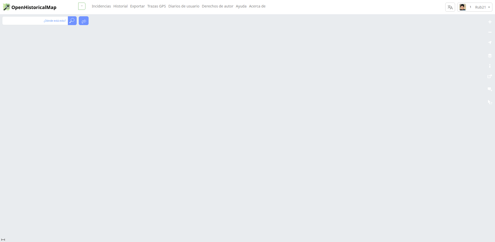

# Testing OHM Website

This repository contains a script for the evaluation of the OHM website in different languages. The automation is built with Selenium, and browsers are executed inside Docker containers to ensure better compatibility across environments.

### Required environment variables

Before running the tests, you must configure your username and password to access the site:

export OHM_USERNAME=Rub21
export OHM_PASSWORD=password

### Running tests

The system can validate both the production and staging environments depending on your needs:

Staging

```sh
docker compose up staging
```

Production

```sh
docker compose up produccion
```

### Logs and output

After tests are completed, the system generates:

- Gif of the evaluated pages for each language.
- Error logs showing which pages failed to load or returned errors:

    - error_log_staging.log → Errors in the staging environment.
    - error_log_production.log → Errors in the production environment.

These files make it easy to review which pages did not load correctly in different languages.


## GIFs recorded for languages

#### spanish



#### Fresh 

